# Ingest and Analyse real-time data with Event Hubs and Stream Analytics
In this lab you will use an Azure Logic App to retrieve high-frequency stock market of Cryptocurrency. Every second the LogicApp retrieve stock purchase transactions for BTC / USDT. The LogicApp then sends stock transaction messages to Event Hubs. You will use Stream Analytics queries to join hot and cold data streams to process the high volume of transactions and generate aggregate calculations. The results will be sent to a real-time dataset in Power BI.

**IMPORTANT**: This lab requires you have a valid Power BI account. If you don’t have one you can register for a 60-day trial here: https://powerbi.microsoft.com/en-us/power-bi-pro/

The estimated time to complete this lab is: **60 minutes**.

## ONCE YOU ARE COMPLETE, PLEASE DELETE ALL RESOURCES YOU USED IN THE WORKSHOP FROM YOUR AZURE PORTAL TO PREVENT CONTINUED USAGE OF YOUR CREDITS.

## Microsoft Learn & Technical Documentation

The following Azure services will be used in this lab. If you need further training resources or access to technical documentation please find in the table below links to Microsoft Learn and to each service's Technical Documentation.

Azure Service | Microsoft Learn | Technical Documentation|
--------------|-----------------|------------------------|
Azure Data Lake Gen2 | [Large Scale Data Processing with Azure Data Lake Storage Gen2](https://docs.microsoft.com/en-us/learn/paths/data-processing-with-azure-adls/) | [Azure Data Lake Gen2 Technical Documentation](https://docs.microsoft.com/en-us/azure/storage/blobs/data-lake-storage-introduction)
Azure Logic Apps | [Build automated workflows to integrate data and apps with Azure Logic Apps](https://docs.microsoft.com/en-us/learn/paths/build-workflows-with-logic-apps/) | [Azure Logic Apps Technical Documentation](https://docs.microsoft.com/en-us/azure/logic-apps/)
Azure Event Hubs | [Enable reliable messaging for Big Data applications using Azure Event Hubs](https://docs.microsoft.com/en-us/learn/modules/enable-reliable-messaging-for-big-data-apps-using-event-hubs/) | [Azure Event Hubs Technical Documentation](https://docs.microsoft.com/en-us/azure/event-hubs/)
Azure Stream Analytics | [Implement a Data Streaming Solution with Azure Streaming Analytics](https://docs.microsoft.com/en-us/learn/paths/implement-data-streaming-with-asa/) | [Azure Stream Analytics Technical Documentation](https://docs.microsoft.com/en-us/azure/stream-analytics/)
Power BI | [Create and use analytics reports with Power BI](https://docs.microsoft.com/en-us/learn/paths/create-use-analytics-reports-power-bi/) | [Power BI Technical Documentation](https://docs.microsoft.com/en-us/power-bi/)

## Lab Architecture


Step     | Description
-------- | -----
 | Review the Azure Logic App logic that simmulates the Crypto transaction stream sent to EventHubs
 | Save simmulated Crypto stock transaction messages into your data lake for future analysis (cold path)
 | Send stream of Crypto stock transaction messages to Stream Analytics for real-time analytics (hot path)
 | Visualize real-time data generated by Stream Analytics with Power BI

**IMPORTANT**: Some of the Azure services provisioned require globally unique name and a “-suffix” has been added to their names to ensure this uniqueness. Please take note of the suffix generated as you will need it for the following resources in this lab:

Name	                     |Type
-----------------------------|--------------------
synapsedatalake*suffix*	         |Storage Account
ADPEventHubs-*suffix*	     |Event Hubs Namespace
SynapseStreamAnalytics-*suffix*	 |Stream Analytics job

# Create CryptoTrades Container in Azure Data Lake Gen2
In this section you will create the CryptoTrades container in your SynapseDataLake that will be used as a repository for the Crypto stock transactions. You will use the EventHubs Capture feature to save the incoming stream of transactions in your data lake.

**IMPORTANT**|
-------------|
**Execute these steps on your host computer**|

1.	In the Azure Portal, go to the lab resource group, and then locate and click the Azure Storage account **synapsedatalake*suffix***. 

2.	On the **Overview** panel, click **Containers**.

    

3.	On the **synapsedatalake*suffix* – Containers** blade, click **+ Container**. On the New container blade, enter the following details:
    <br>- **Name**: cryptotrades
    <br>- **Public access level**: Private (no anonymous access)

    

4.	Click **OK** to create the new container.

## Review the Azure LogicApp implementation

In this section you will review the implementation of the LogicApp used to retrieve high-frequency stock purchase transactions. These transactions will be formatted as JSON messages and sent to Event Hubs for processing.

1. Add HTTP Trigger and configure as following

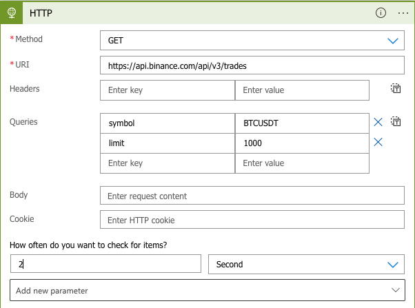

2. Add ParseJSON action and configure using the following schema

```json
{
    "items": {
        "properties": {
            "id": {
                "type": "integer"
            },
            "isBestMatch": {
                "type": "boolean"
            },
            "isBuyerMaker": {
                "type": "boolean"
            },
            "price": {
                "type": "string"
            },
            "qty": {
                "type": "string"
            },
            "quoteQty": {
                "type": "string"
            },
            "symbol": {
                "default": "BTC/USDT",
                "type": "string"
            },
            "time": {
                "type": "integer"
            }
        },
        "required": [
            "id",
            "price",
            "qty",
            "quoteQty",
            "time",
            "isBuyerMaker",
            "isBestMatch"
        ],
        "type": "object"
    },
    "type": "array"
}
```

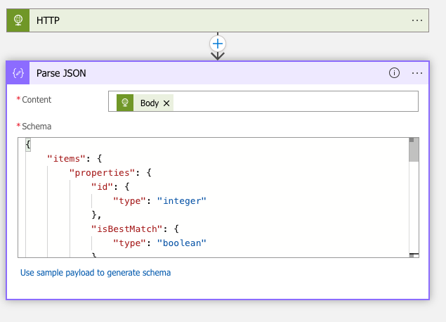

3. Add a EventHub send event action and configure as following

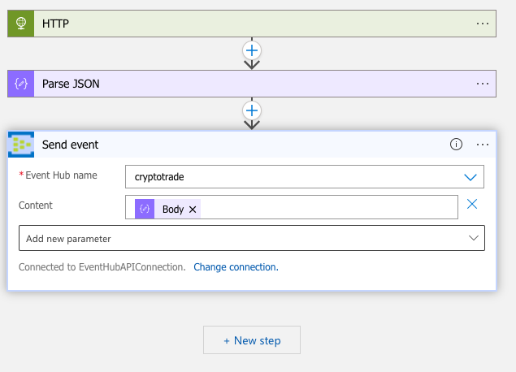

4. Save the Logic App

5. The format of each stock purchase transaction message generated looks like this:

```json
{
        "id": 420536769,
        "price": "0.08310000",
        "qty": "1961.00000000",
        "quoteQty": "162.95910000",
        "time": 1653493514429,
        "isBuyerMaker": true,
        "isBestMatch": true
    }
```

6. Return to the **Overview** panel. Note that the LogicApp is disabled by default. Click **Enable** to enable the LogicApp to start firing every second.

    


## Configure Capture for Event Hubs
In this section you will prepare Event Hubs to ingest Crypto stock trade messages generated by the LogicApp and save to your Synapse Data Lake account.


**IMPORTANT**|
-------------|
**Execute these steps on your host computer**|

1.	In the Azure Portal, go to the lab resource group and locate the Event Hubs resource **ADPEventHubs-*suffix***. 

2.	On the **Event Hubs** panel, note that the **cryptotrade** Event Hub has already been created for you. This is the same Event Hub you saw referenced by the LogicApp in the previous section. 

    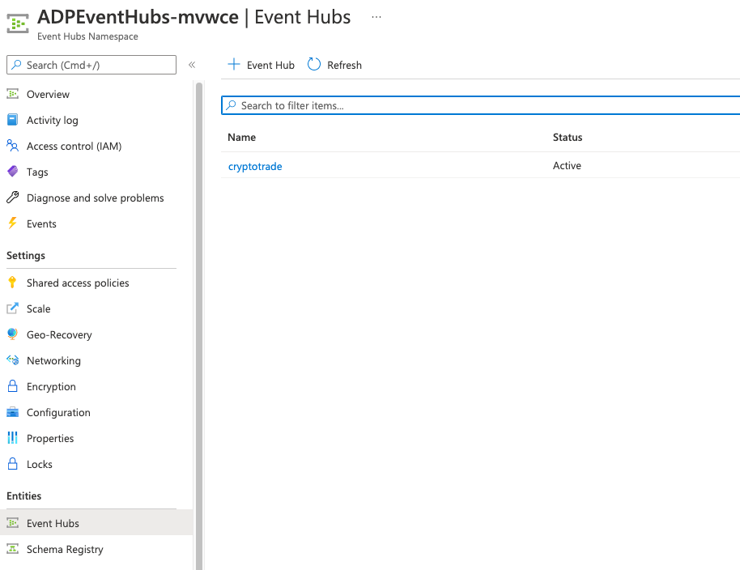

3. Click on the **cryptotrade** Event Hub to open its settings. Then click on the **Capture** item on the left-hand side menu.

    

4.	Enter the following details:
    <br>- **Capture**: On
    <br>- **Time window (minutes)**: 1
    <br>- **Do not emit empty files when no events occur during the capture time window**: Checked.
    <br>- **Capture Provider**: Azure Storage
    <br>- **Azure Storage Container**: [select the **cryptotrades** container in your **synapsedatalake*suffix*** storage account]
7.	Leave remaining fields with their default values.
8.	Click **Save Changes**.

    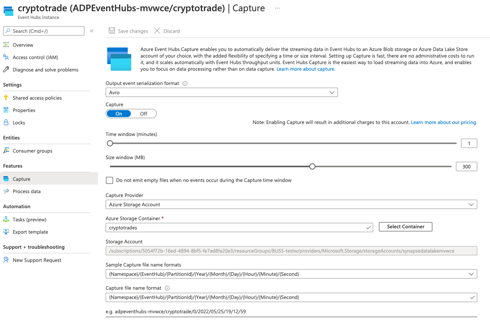

### Optional: Investigate CryptoTrades Container contents

1. On your SynapseDataLake account, navigate to the CryptoTrades container you created in the previous section.

2. You should be able to see the folder structure created by Event Hubs Capture with AVRO files containing the individual stock purchase transaction messages generated by the LogicApp. These files can then be used in other analytics worlkloads whenever the granular detail about each individual transaction is required.

    


## Configure Stream Analytics Job
In this section you will configure your Stream Analytics job to join hot and cold data streams and execute queries on data sent by Event Hubs and generate outputs to Power BI.


**IMPORTANT**|
-------------|
**Execute these steps on your host computer**|

1.	In the Azure Portal, go to the lab resource group and locate the Stream Analytics resource **SynapseStreamAnalytics-*suffix***. 

2.	On the Inputs panel, click **+ Add stream input** button and select **Event Hub** to create a new input stream.

    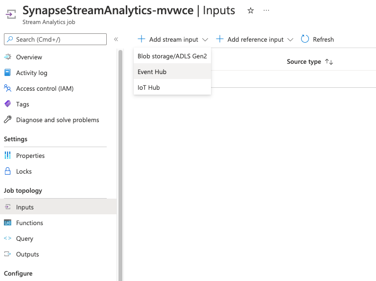

3.	On the **Event Hub New input** blade enter the following details:
    <br>- **Input alias**: CryptoTrades
    <br>- **Event Hub namespace**: ADPEventHubs-suffix
    <br>- **Event hub name > Use existing**: cryptotrades

4.	Leave remaining fields with their default values.

    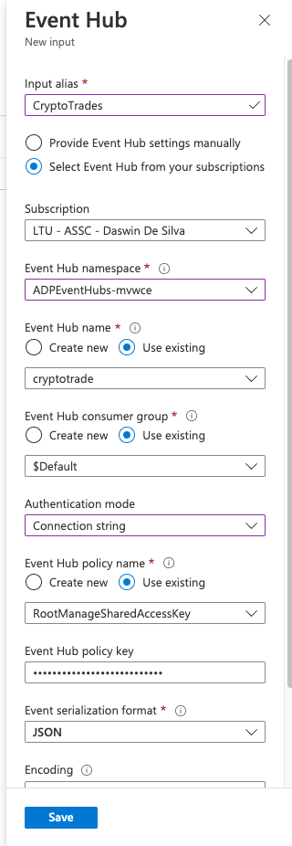

5.	Not click on the **Outputs** panel on the left-hand side menu. Once it is loaded, click **+ Add** button and select **Power BI** to create a new output stream.

    


9.	On the **Power BI New Output** blade, click **Authorize** to authenticate with Power BI. Enter your credentials to authenticate.
    
    

10.	Once authenticated, enter the following details:
    <br>- **Output alias**: BTCUSDTCandleSticks
    <br>- **Authentication Mode**: User Token
    <br>- **Group Workspace**: My Workspace
    <br>- **Dataset name**: BTCUSDTCandleSticks
    <br>- **Table name**: BTCUSDTCandleSticks

**IMPORTANT**: Set **Authentication Mode** to **User Token** before you can select **My Workspace** for **Group Workspace**.

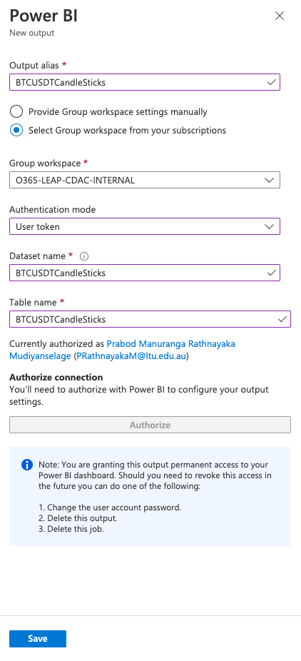

11.	Leave remaining fields with their default values.

12.	Click **Save** to save your output stream and return to the **Outputs** panel.

13.	On the **Query** panel, note the inputs and outputs you created in the previous steps. 

    

16.	Enter the following SQL commands in the query window.

```sql
--BTC/USDT Candlesticks for past 30 seconds and calculated every 5 seconds
SELECT
    'BTC/USDT' as Symbol
    ,SUM(CAST(Trades.qty AS float)) AS Volume
    ,MAX(CAST(Trades.price AS float)) AS High
    ,MIN(CAST(Trades.price AS float)) AS Low
    ,CAST(GetRecordPropertyValue((TopOne() OVER (ORDER BY Trades.time ASC)),'price') AS float) AS [Open] 
    ,CAST(GetRecordPropertyValue((TopOne() OVER (ORDER BY Trades.time DESC)),'price') AS float) AS [Close]
    ,COUNT(*) as NoOfTrades
    ,SUM(CAST(Trades.quoteQty AS float)) AS TotalAmount
    , System.Timestamp AS WindowDateTime
INTO
    [BTCUSDTCandleSticks] 
FROM
    [CryptoTrades] AS Trades TIMESTAMP BY dateadd(MS, [time], '1970-01-01')
GROUP BY 'BTC/USDT', HoppingWindow(second, 30, 5)
```

17.	Click **Save query**.

18.	On the **Overview** panel, click **Start** to start the Stream Analytics job.

    

18. On the **Start job** blade, select **Now** and click the **Start** button.

    


# Create Power BI Dashboard to Visualise Real-Time Data
In this section you will log on to the Power BI portal to create a dashboard to visualize real-time stock transactions statistics data sent by Stream Analytics.


**IMPORTANT**|
-------------|
**Execute these steps on your host computer**|

1.	Open a new browser tab and navigate to https://www.powerbi.com
2.	Enter your credentials to authenticate with the Power BI service.

    

3.	Once authenticated, open the **Workspaces** menu and click **My Workspace** at the top of the Workspaces list.

    

4.	Navigate to the **Datasets** tab and verify that two datasets have been created by Stream Analytics: **BTCUSDTCandleSticks**.

    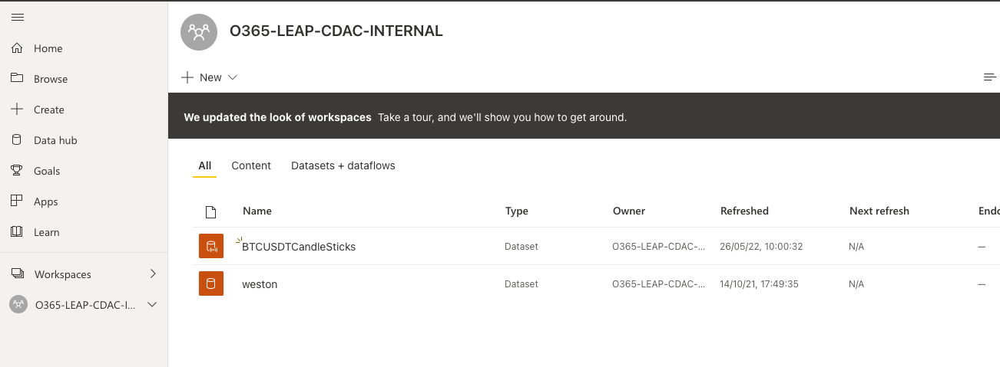

5.	On the top lef-hand side corner click **+ Create** and then click **Dashboard** from the dropdown menu to create a new dashboard.

    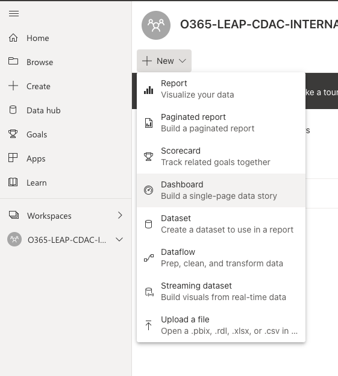

6.	Type **Crypto Trade Activity** in the **Dashboard name** field and click **Create**.

7.	Click on the *(elipsis)* **...** button from the toolbar and then click on the **+ Add tile** menu item. 

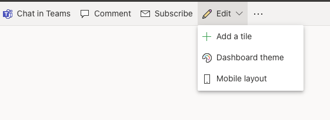

8.	On the **Add tile** blade, select **Custom Streaming Data** under the **Real-Time Data** section.

9.	Click **Next**.

    

10.	On the **Add a custom streaming data tile** blade, select the **StockTradeTotals** dataset.

11.	Click **Next**.

    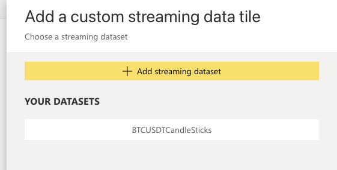

12.	On the **Visualization Type** field select **Card**.

13.	On the **Fields** field select **TotalAmount**.

    

14. Click on the brush icon to set the **Value decimal places** field to **2**.

    

15.	Click **Next**.

16.	On the **Tile details** blade, enter the following details:
    <br>- **Title**: Total Traded Amount (USD)
    <br>- **Subtitle**: in the last 30 seconds

    

17.	Leave remaining fields with their default values. Click **Apply**.

18.	Repeat the process to create another tile, this time to display the total trade count. Use the following details:
    <br>- **Visualization Type**: Card
    <br>- **Fields**: TotalTradeCount
    <br>- **Details > Title**: Total Trade Count
    <br>- **Details > Subtitle**: in the last 30 seconds

    

19.	You should be able to see the values for both tiles changing every 5 seconds. 

20. Repeat the process to create another tile, this time to display the historical values for BTC/USDT CandleSticks over the last 5 minutes.
    <br>- **Visualization Type**: Line Chart
    <br>- **Axis**: WindowDateTime
    <br>- **Value**: High
    <br>- **Value**: Low
    <br>- **Value**: Open
    <br>- **Value**: Close
    <br>- **Time window to display**: 5 minutes
    <br>- **Details > Title**: BTC/USDT Candlesticks
    <br>- **Details > Subtitle**: 5 min history window

    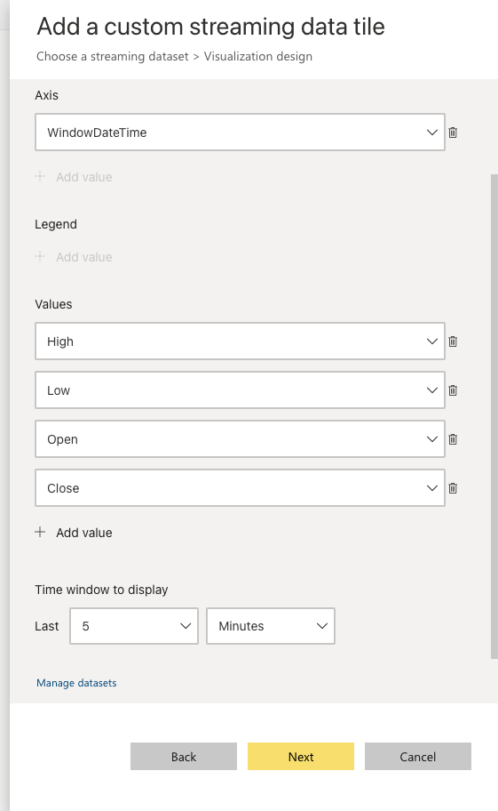


22. Your real-time dashboard should look similar to the picture below. Every tile should be refreshed approximately every 5 seconds.

    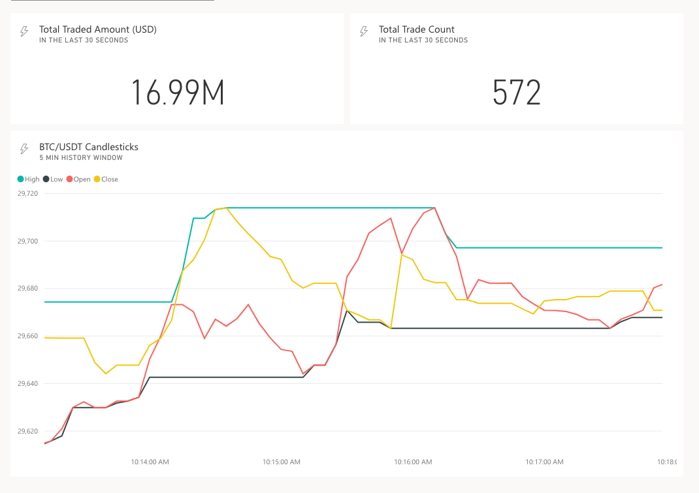

# ONCE YOU ARE COMPLETE, PLEASE DELETE ALL RESOURCES YOU USED IN THE WORKSHOP FROM YOUR AZURE PORTAL TO PREVENT CONTINUED USAGE OF YOUR CREDITS.
